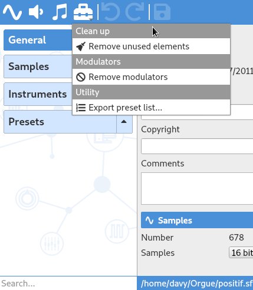
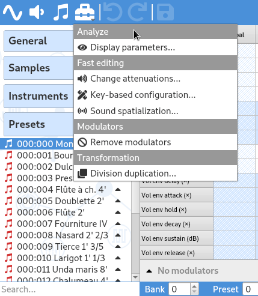

.. _tool menu:

Tools
=====

Once you understand how soundfonts work (through the different
:ref:`editors <editing pages>`), tools are probably what you should care of.
They are all designed to fasten / automate the editing and to avoid common
errors or imprecision that a human usually does.

Tools are all available in a menu that is displayed when clicking
on the toolbox icon in the :ref:`toolbar <toolbar edit>`. The content
of this menu depends on the selection in the :ref:`tree <tree>`: first
on the kind of selection (as described below) but also on the number
of selected elements. A few tools cannot process multiple elements so they
will be hidden with a multiple selection.

Contents:

.. toctree::
   :maxdepth: 2

   global-tools
   sample-tools
   instrument-tools
   preset-tools

Global tools
------------

When the header :guilabel:`General` is selected in the :ref:`tree <tree>`,
the tool menu is filled with :ref:`global tools <global tools>`.

   Tool menu showing global tools

Sample tools
------------

When one or more samples are selected in the :ref:`tree <tree>`,
the tool menu is filled with :ref:`sample tools <sample tools>`.

.. figure:: images/tool_menu_sample.png

   Tool menu showing sample tools

Instrument tools
----------------

When one or more instruments (including the divisions) are selected in the
:ref:`tree <tree>`, the tool menu is filled with
:ref:`instrument tools <instrument tools>`.

   Tool menu showing instrument tools

Preset tools
------------

When one or more presets (including the divisions) are selected in the
:ref:`tree <tree>`, the tool menu is filled with
:ref:`preset tools <preset tools>`.

   Tool menu showing preset tools
